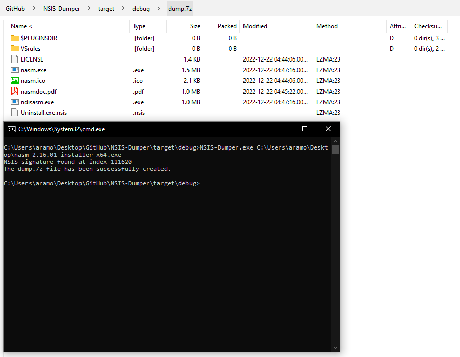

<h1 align="center">NSIS Dumper</h1>

  
  
  

    A simple Rust project designed to statically dump NSIS installers for various purposes.

## Table of contents
- [About](#about)
- [Pictures](#pictures)
- [Installation](#installation)
- [Usage](#usage)
- [Contribute](#contribute)
- [License](#license)

## About
This project is designed to facilitate malware analysis and reverse engineering. I created it for educational purposes and to contribute to my learning of the Rust language.

## Pictures

  

## Installation
* Clone the project: `git clone https://github.com/0v41n/NSIS-Dumper.git`
* Go to the project directory: `cd NSIS-Dumper`
* Compile the project: `cargo run`

Alternatively, you can download the pre-compiled executable from the [Releases](https://github.com/0v41n/NSIS-Dumper/releases) section. 
## Usage
* Run the project : `NSIS-Dumper.exe NSIS_file.exe`

## Contribute
Contributions are welcome! Follow these steps to contribute to this project:
1. Fork the project.
2. Create a branch: `git checkout -b feature/NewFeature`.
3. Make the necessary changes and commit: `git commit -am 'Add new feature'`.
4. Push to branch: `git push origin feature/NewFeature`
5. Submit a pull request.

## License
This project is licensed under the MIT licence. See the [LICENSE](LICENSE) file for more details.

## Contact
Yvain Ramora - yvain@mailfence.com

  Project created with ❤️

